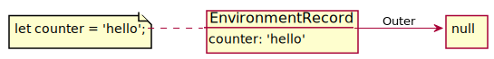
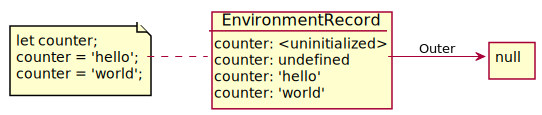
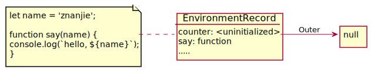

# Return true to Win
>  A series of JavaScript challenges.  
>
>  >项目关于 Javascript 的一些**有趣**的知识点，只要让返回的结果为 `true` 即视为赢得了游戏，最优解是使用最少字符的答案。

## 挑战地址
- [Return true to Win](https://alf.nu/ReturnTrue)

## 环境
> Google Chrome 84.0.4147.135（正式版本） （64 位）

## 目录
- [x] [id (2)](#id)
- [x] [reflexive (3)](#reflexive)
- [x] [transitive (8)](#transitive)
- [x] [peano (7)](#peano)
- [x] [counter (13)](#counter)

## id
```js
function id(x) {
    return x;
}
id(!0); // true
```
> 热身题

## reflexive
```js
function reflexive(x) {
    return x != x;
}
reflexive(NaN); // true
```
> 值 `NaN` 是独一无二的，它不等于任何东西，包括它自身。

## transitive
```js
function transitive(x,y,z) {
    return x && x == y && y == z && x != z;
}
transitive('0',0,''); // true
```
> 类型转换问题。对于基本类型 `Boolean`，`Number`，`String`，三者之间做比较时，总是向 `Number` 进行类型转换，然后再比较。
### 上述类型转换过程：
```js
x = '0', y = 0, z = '';
/*
 * 1. Boolean(x) ==> true
 * 2. Number(x) == y ==> true
 * 3. y == Number(z) ==> true
 */
```
### 基本类型转换拓展之对象（Object）
```js
x = 1, y = {i:0, valueOf() {return ++this.i;}}, z = 2;
transitive(1,{i:0, valueOf() {return ++this.i;}},2); // true

// === 类型转换过程 ===
/*
 * 1. Boolean(x) ==> true
 * 2. x == Number(y) ==> true, Number(y) === 1
 * 3. Number(y) == z ==> true, Number(y) === 2
 */
```
> 代码中的 `x == y` 和 `y == z`，都触发了类型转换，也就是 `Number(y)` 触发了 `valueOf()` 方法。  
> 上述方案重写了对象的 `valueOf()`，使其每次触发类型转换时返回的值 +1。

## peano
```js
function peano(x) {
    return (x++ !== x) && (x++ === x);
}
peano(2**53-1); // true
```
> 最大安全整数：`Number.MAX_SAFE_INTEGER === (Math.pow(2, 53) - 1) === (2**53 - 1)`
### 安全整数
这里的知识点其实已经和 JavaScript 无关了，但凡遵循**IEEE二进制浮点数算术标准**（`IEEE 754`）的编程语言都有相同的表现。  
- JavaScript 的数字是以64位（64-bits）的二进制格式存储的。

||符号位（sign）|指数（exponent）|尾数（fraction）
---|---|---|---
Size/bit|1bit|11bit|52bit
Index|63|62-52|51-0
- [Safe integers in JavaScript](https://2ality.com/2013/10/safe-integers.html)
> In the range (−253, 253) (excluding the lower and upper bounds), JavaScript integers are safe: there is a one-to-one mapping between mathematical integers and their representations in JavaScript.  

简单翻译理解：在 (-2^53, 2^53) 的开区间中的所有整数为安全整数，**双精度浮点数和整数具有一对一（one-to-one）的映射关系**，也就是说在这个范围内的双精度浮点数只能表达**唯一**的整数。超出了这个范围的双精度浮点数是可以表达多个整数的。
### 数值对比
十进制|科学计数|双精度浮点数|描述
:---:|:---:|---|---
|1.{53个0} * |1.{52个0} * |浮点数尾数部分只保留52位，浮点数最后一位无法存储被省略。
|1.{52个0}1 * |1.{52个0} * |浮点数尾数部分只保留52位，浮点数最后一位无法存储被省略。

可以看出，双精度浮点数 `1.{52个0} * 2^53` 可以表示两个整数，在 JavaScript 中会被认为为`不安全整数`，它们不符合**双精度浮点数和整数具有一对一（one-to-one）的映射关系**这一描述。而实际中，这个两个非安全数对比，也就是 `(2^53 === 2^53 + 1) ===> true` , JavaScript 对比的其实是两个数的双进度浮点数，也就是 `(1.{52个0} * 2^53 === 1.{52个0} * 2^53) ===> true`。

## counter
```js
function counter(f) {
    var a = f(), b = f();
    return a() == 1 && a() == 2 && a() == 3
        && b() == 1 && b() == 2;
}
// answer
counter((i=0)=>$=>++i);// true
// detail
counter(()=>{
    let i = 0;
    return ()=> ++i;
}); // true
```
> 闭包：内部函数总是可以访问其所在的外部函数中声明的变量和参数，即使在其外部函数被返回（寿命终结）了之后。  
### 词法环境（Lexical Environment）
在 `ES6` 之前我们通常把这称为 `作用域`。
> 在 JavaScript 中，每个运行的函数，代码块 `{...}` 以及整个脚本，都有一个被称为 **词法环境（Lexical Environment）** 的内部（隐藏）的关联**对象**。

词法环境对象由两部分组成：
- **环境记录（Environment Record）**：一个存储所有局部变量作为其属性（包括一些其他信息，例如 this 的值）的对象。
  - **声明式环境记录（Declarative Environment Record）**
  - **对象式环境记录（Object Environment Record）**
  - **全局环境记录（Global Environment Record）**
- **对外部词法环境的引用（Outer）**：对 **外部词法环境** 的引用，与外部代码相关联

<div align=center>
    
</div>

#### 声明式环境记录（Declarative Environment Record）
- **变量声明**：一个“变量”只是 **环境记录** 这个特殊的内部 **对象** 的一个 **属性**。“获取或修改变量”意味着“获取或修改词法环境（对象）的一个属性”。

<br/>
<div align=center>
    
</div>
<br/>

> 上图左边为脚本文件，`LexicalEnvironment` 表示为 `环境记录（Environment Record）`，箭头（`Outer`）表示 `对外部词法环境的引用`，**全局词法环境没有外部引用**，所以箭头指向了 `null`。  
`LexicalEnvironment` 在此处用对象的方式来表达，`counter` 为 `LexicalEnvironment` 这一对象的一个属性，其值为 `hello`。

<br/>
<div align=center>
    
</div>
<br/>

> - 变量是特殊内部对象的属性，与当前正在执行的（代码）块/函数/脚本有关。
> - 操作变量实际上是操作该对象的属性。

> 上图主要描述代码执行的过程中词法环境变量的变化：JavaScript 引擎执行之初，能够获取当前词法环境的所有变量，变量都处在一个 `未初始化（Uninitialized）` 的状态，在 `let` 声明之前是不允许使用的，我们通常把这个称为 **暂时性死区（Temporal Dead Zone）**。

```js
// execution start    ······ counter: <uninitialized>
// 当前的词法环境具有 暂时性死区（Temporal Dead Zone）
typeof counter;
// ReferenceError: Cannot access 'counter' before initialization
let counter; //       ······ counter: undefined
counter = 'hello'; // ······ counter: 'hello'
counter = 'world'; // ······ counter: 'world'
```

- **函数声明**：一个函数其实也是一个值，就像变量一样。**不同之处在于函数声明的初始化会被立即完成**。  
当创建了一个词法环境（Lexical Environment）时，函数声明会立即变为即用型函数（不像 `let` 那样直到声明处才可用）。  
这就是为什么我们可以在（函数声明的）定义之前调用函数声明。

<br/>
<div align=center>
    
</div>
<br/>

```js
/**
 * execution start ······ counter: <uninitialized>
 *                 ······ say: function
 */
let name = 'znanjie';

function say(name) {
    console.log(`hello, ${name}`);
}
```

**这种行为仅适用于函数声明，而不适用于我们将函数分配给变量的函数表达式，例如 `let say = function(name)...`。**